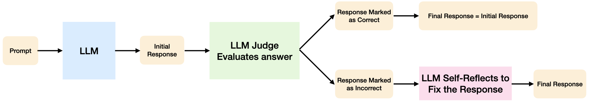

# LLM Judge 

**Problem Statement:** Given the GSM8k dataset, generate the answer to the questions, 
use an LLM judge to evaluate the responses, 
then use a self-reflection step to regenerate answers to those questions 
which the LLM judge has decided that they were not correct.
Compare the accuracy of each step to record whether the AI system is better than simply using the LLM generator.

**AI system design:**

**Hints:**

Hint 1: When prompting the LLM at the judge and self-reflection steps, keep adding the assistant's responses to the chat.

**Real world LLM-as-judge examples** 

[Improving retrieval with LLM-as-a-judge](https://blog.vespa.ai/improving-retrieval-with-llm-as-a-judge/)
