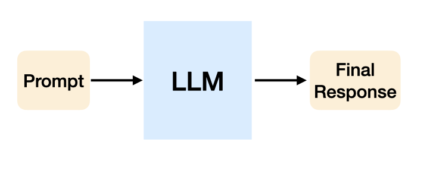
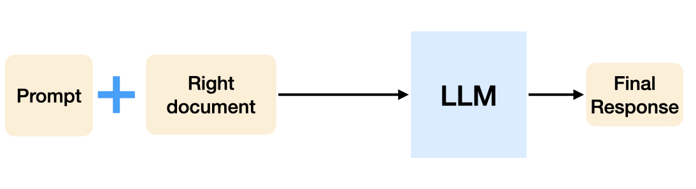
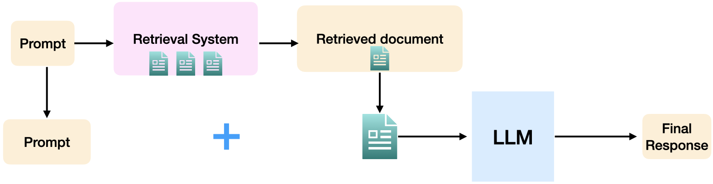

# Retrieval Exercise  

**Problem Statement:** For domain specific problems such as answering complicated legal questions, using pretrained LLMs as they are might not suffice. 
In such scenarios, retrieving the right documents, then add them to the context, and ask the same LLM to see how the accuracy might change. 
Once it is determined that using retrieved document, the system might do better than using the pretrained LLM alone, we then set up a pipeline with a retrieval system, and using an LLM to answer the users question.

The dataset to be used in this exercise is [housing_qa](https://huggingface.co/datasets/reglab/housing_qa) from [Stanford Regulation, Evaluation and Governance Lab](https://reglab.stanford.edu/). You can read more about the dataset on [Hugging Face](https://huggingface.co/datasets/reglab/housing_qa), and the original paper [A Reasoning-Focused Legal Retrieval Benchmark](https://arxiv.org/abs/2505.03970) by Zheng et al.

This exercise helps you set up a simple RAG system. 

### AI system design

**Step 1: Evaluate when an LLM answer legal questions alone**

**Step 2: Evaluate when an LLM answer legal questions with the right document**

**Step 3: Evaluate when the RAG system where LLM answer legal questions with the documents retrieved using a retrieval system**

At each step, there is an accuracy number associated with that particular step. Remember to calculate these accuracies along the way, and see if at the end they follow your expectations.

**Hints:**

Hint 1: When building the pipeline experimenting with the first 20, 50, 100, 200 data points in the dataset to see whether the pipeline works as expected
Hint 2 (Advanced level): Beyond TFIDF and ngram in the problem statement, you can experiment with more advanced embedding methodology such as embedding models from OpenAI, Anthropic.  
Hint 3 (Advanced level): Implement an index using FAISS to store all the statutes to speed up the cosine similarities calculation for the entire dataset  

