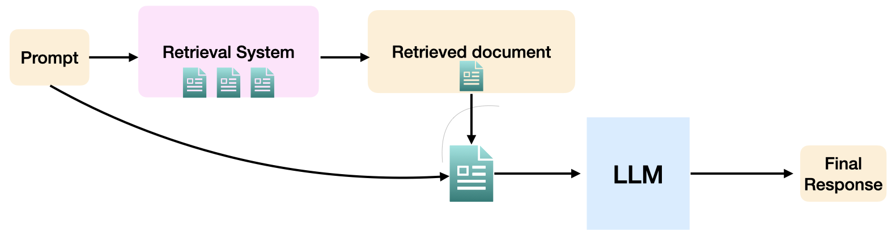

# LLM Exercises

This repo contains LLM exercises to help people learn core concepts in LLM space such as prompt engineering, retrieval, agentic designs (e.g., self-reflection), evaluation (e.g., LLM Judge).

I plan to keep adding more exercises. Each exercise is self-contained in a folder and contains a problem file containing parts that need to be implemented and a solution file containing a solution (there can be other ways to solve the problem as well). There is also a writeup on each solution that can you read to understand it.

Please create a pull request or issues for questions, bugfixes, or proposing alternate solutions.

## Installation

The default llms for this project are OpenAI models. You will need an OpenAI API Key to use them. 

Install the requirements file

```python3 -m pip install -r requirements.txt```

Before running any script, set the API key as an environment variable:

```export OPENAI_KEY=...```

## List of Exercises 

### Exercise 1: Implementing LLM Judge and Self-Reflection


The goal of this exercise is to build an LLM judge to detect failures in a model's reasoning and a self-reflection step to try to recover from those failures. Using these two steps together can help improve the model's original peformance.

The folder 00_llm_judge folder contains this exercise and contains the problem definition in `problem.py` and solution in `solution.py`

### Exercise 2: Retrieval Augmented Generation 



The goal of this exercise is to build a simple Retrieval Augmented Generation (RAG) system to retrieve the right document to answer a domain specific question (legal domain).

The folder 00_llm_retrieval folder contains this exercise and contains the problem definition in `problem.py` and solution in `solution.py`


